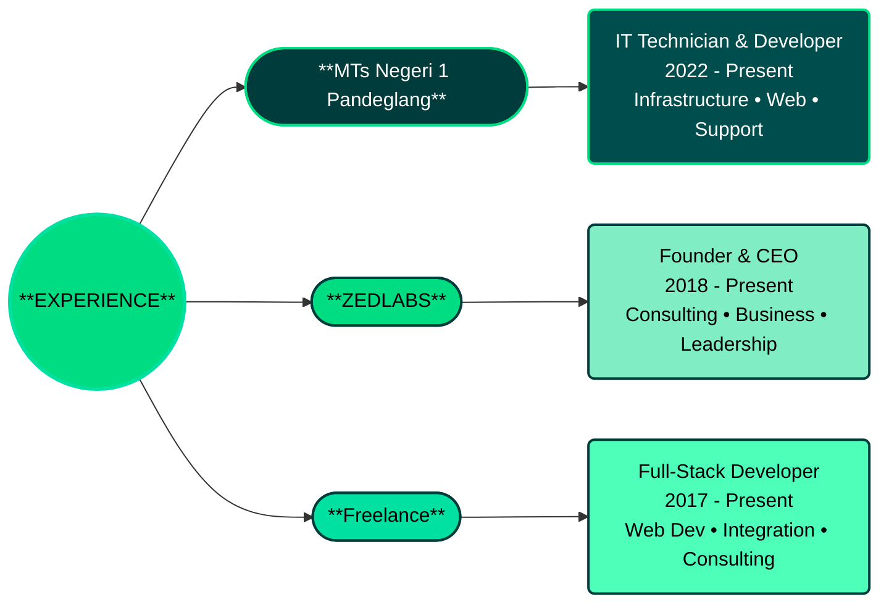
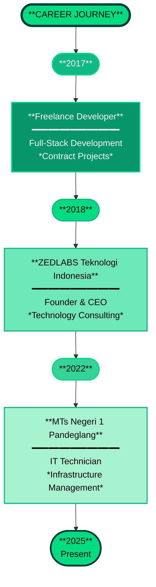

# YAHYA ZULFIKRI

 

**Location:** Pandeglang, Banten, Indonesia **| Email:** [zulfikriyahya18@gmail.com](mailto:zulfikriyahya18@gmail.com)

**Founder:** ZEDLABS Teknologi Indonesia

---

  
## MISSION STATEMENT

> **"Bridging Technology & Education | Building Robust Solutions | Continuously Growing"**

---

## TABLE OF CONTENTS

- [About Me](#about-me)
- [Professional Experience](#professional-experience)
- [Technology Arsenal](#technology-arsenal)
- [Expertise & Competencies](#expertise--competencies)
- [Services & Solutions](#services--solutions)
- [Featured Highlights](#featured-highlights)
- [Continuous Learning](#continuous-learning)
- [Special Interests](#special-interests)
- [Philosophy & Mindset](#philosophy--mindset)
- [GitHub Analytics](#github-analytics)
- [Opportunities & Collaboration](#opportunities--collaboration)
- [Support & Contribution](#support--contribution)
- [Connect With Me](#connect-with-me)

---

## ABOUT ME

|           Role            |          Expertise          |         Philosophy          |
| :-----------------------: | :-------------------------: | :-------------------------: |
|  **IT Technician**    | **Full-Stack Developer** |**System Administrator** |
| Technology & Education |    Debian Enthusiast     |      Tech Innovator      |

> I'm **Yahya Zulfikri**, a multi-disciplinary technology professional with expertise spanning from embedded systems and IoT to cloud-native architectures.  
> With a proven track record of designing and implementing innovative solutions, I combine technical excellence with a passion for education and knowledge sharing.

### My Approach

- **Problem-First Mindset** – Understand challenges before crafting solutions
- **Innovation-Driven** – Leverage emerging technologies for competitive advantage
- **Continuous Excellence** – Committed to learning, improving, and evolving
- **Collaborative Spirit** – Believe in teamwork and mentorship
- **Quality Obsessed** – Every line of code follows clean code principles

### Current Focus Areas

- Full-stack web development with modern frameworks
- System architecture and infrastructure design
- IoT and embedded systems solutions
- Educational technology initiatives
- Business technology consulting

---

## PROFESSIONAL EXPERIENCE

### EXPERIENCE

### CAREER TIMELINE

---

## TECHNOLOGY ARSENAL

### PROGRAMMING LANGUAGES

### FRONTEND TECHNOLOGIES

### BACKEND FRAMEWORKS

### DATABASES

### DEVOPS & TOOLS

### CLOUD & HOSTING

### IoT & EMBEDDED SYSTEMS

### NETWORKING & INFRASTRUCTURE

### MONITORING & ANALYTICS

---

## EXPERTISE & COMPETENCIES

### CORE COMPETENCIES

#### WEB DEVELOPMENT

- Full-Stack Architecture
- Microservices
- API Design & Implementation
- Real-time Systems

#### SYSTEM ADMINISTRATION

- Server Management
- Networking
- Infrastructure Design
- DevOps & Automation

#### DATABASE ENGINEERING

- Relational & NoSQL Databases
- Performance Optimization
- Data Modeling

#### IoT & EMBEDDED SYSTEMS

- Microcontroller Programming
- Hardware Design
- IoT Solutions
- Edge Computing

#### SOFTWARE ENGINEERING

- Clean Code Principles
- Design Patterns
- Performance Optimization
- Security Best Practices

---

## SERVICES & SOLUTIONS

### WHAT I OFFER

#### Full-Stack Web Development

- Custom web applications from concept to deployment
- Responsive, modern, user-centric designs
- Scalable architecture using latest frameworks (Next.js, Laravel, Nuxt.js)
- API development and integration
- Performance optimization and SEO

#### System Architecture & Infrastructure

- IT infrastructure design and implementation
- Server setup, configuration, and management
- Network design and troubleshooting
- Security hardening and compliance
- Cloud migration and optimization

#### IoT & Embedded Systems

- IoT solution design and implementation
- Microcontroller programming and development
- Hardware-software integration
- Real-time system solutions
- Edge computing applications

#### Technical Consulting & Education

- Technology strategy and roadmap development
- Technical documentation and knowledge base creation
- Staff training and mentorship
- Best practices implementation
- Performance auditing and optimization

#### Business Technology Solutions

- Digital transformation initiatives
- Process automation
- Business intelligence and analytics
- Custom software development
- Technology team building and management

---

## FEATURED HIGHLIGHTS

### KEY ACHIEVEMENTS

- Founded and scaled ZEDLABS Teknologi Indonesia
- Developed 50+ full-stack web applications
- Managed critical IT infrastructure for educational institution
- Mentored 100+ junior developers
- Contributed to open-source projects
- Specialized in Laravel, React, and Node.js ecosystems
- Expert in Debian Linux and server administration
- Professional in IoT and embedded systems development

### PROJECT HIGHLIGHTS

- **Enterprise Web Applications** - Multi-tenant SaaS platforms using Laravel & React
- **Educational Technology** - Learning management systems for institutions
- **IoT Solutions** - Smart monitoring systems using microcontrollers
- **API Services** - RESTful and GraphQL APIs serving millions of requests
- **Infrastructure Projects** - Server virtualization and network optimization

---

## CONTINUOUS LEARNING

### DEVELOPMENT ROADMAP

**CURRENT MASTERY:**

- Full-Stack Web Development
- System Administration
- Database Design & Optimization
- IoT & Embedded Systems
- Clean Code & Best Practices

**ACTIVELY LEARNING:**

- Advanced Cloud Architecture (AWS, GCP, Azure)
- Kubernetes & Container Orchestration
- GraphQL & Advanced API Design
- Machine Learning Applications
- Cybersecurity & Infrastructure Hardening
- Advanced Performance Engineering

**FUTURE FOCUS:**

- AI-Powered Solutions
- Blockchain & Web3 Technologies
- Advanced System Design
- Emerging Frameworks & Technologies
- Technical Leadership & Mentorship

---

## SPECIAL INTERESTS

|         Interest         | Focus                                      |
| :----------------------: | ------------------------------------------ |
|   **Photography**        | Capturing technology, nature, and moments  |
|**IoT & Innovation**      | Building smart, connected solutions        |
|     **Education**        | Teaching and mentoring the next generation |
|   **Architecture**       | Designing robust and scalable systems      |
|    **Networking**        | Building connections and communities       |
| **Knowledge Sharing**    | Documentation and technical writing        |
|     **Security**         | Protecting systems and data integrity      |
|    **Innovation**        | Exploring emerging technologies            |

---

## PHILOSOPHY & MINDSET

### MY CORE VALUES

> "Technology bridges the gap between dreams and reality. Every challenge is an opportunity to innovate, every solution a chance to grow."
> **— Yahya Zulfikri**

**My Principles:**

- **Excellence First** - Quality over quantity, always
- **Lifelong Learning** - Stay curious, stay ahead
- **Problem Solving** - Find elegant solutions to complex challenges
- **Collaboration** - Great things happen together
- **Impact Driven** - Build solutions that matter
- **Continuous Growth** - Today's achievement is tomorrow's baseline

---

## GITHUB ANALYTICS

### PERFORMANCE METRICS

### LANGUAGE DISTRIBUTION

### CONTRIBUTION STREAK

### ACTIVITY GRAPH

---

## OPPORTUNITIES & COLLABORATION

### I'M OPEN TO

- Full-Stack Web Development Projects
- System Architecture & Consulting
- IoT & Embedded Systems Solutions
- Technical Mentorship & Training
- Business Partnerships
- Open Source Contributions
- Freelance Contracts
- Startup Ventures

---

## SUPPORT & CONTRIBUTION

### HELP ME GROW

If you find value in my work:

- Star ⭐ repositories that inspire you
- Follow to stay updated with my latest work
- Share my projects with your network
- Contribute ideas and improvements
- Connect and collaborate on exciting projects
- Provide feedback and suggestions

---

## CONNECT WITH ME

### PROFESSIONAL NETWORKS

### BUSINESS & PORTFOLIO

### DIRECT CONTACT

**Email:** [zulfikriyahya18@gmail.com](mailto:zulfikriyahya18@gmail.com)
**LinkedIn:** [linkedin.com/in/zulfikriyahya](https://linkedin.com/in/zulfikriyahya)
**Website:** [zedlabs.id](https://zedlabs.id)
**Docs:** [docs.zedlabs.id](https://docs.zedlabs.id)
**GitHub:** [github.com/zulfikriyahya](https://github.com/zulfikriyahya)

---

## THANK YOU FOR VISITING

### _Let's Build The Future Together_

 

**Made with ❤️ and ☕ by Yahya Zulfikri**

_Last Updated: October 2025_

 

**Vision:** Technology for Everyone
**Mission:** Build, Learn, Teach, Grow
**Motto:** Lifelong Learner

