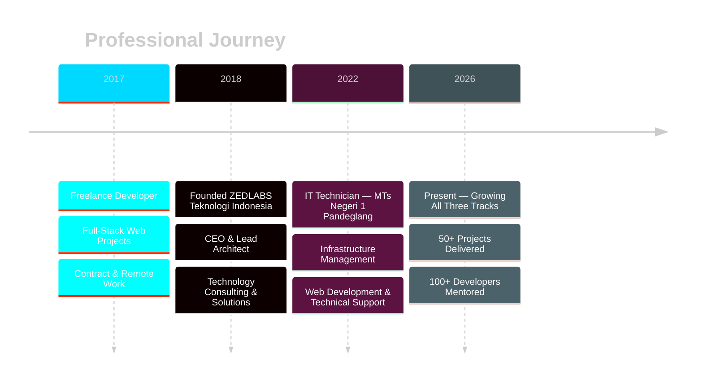

<div align="center">

<!-- ANIMATED HEADER BANNER -->


<!-- TYPING SVG -->


<br/>

<!-- PROFILE BADGES ROW -->
[](https://github.com/zulfikriyahya)
[](https://github.com/zulfikriyahya?tab=followers)
[](https://github.com/zulfikriyahya)
[](https://github.com/zulfikriyahya)

</div>

---

<!-- ABOUT ME SECTION -->


##  About Me


```yaml
name        : Yahya Zulfikri
location    : Pandeglang, Banten, Indonesia
company     : ZEDLABS Teknologi Indonesia
role        : Founder & Full-Stack Developer
experience  : 8+ years (since 2017)

currently   :
  - IT Technician @ MTs Negeri 1 Pandeglang
  - Building products at ZEDLABS
  - Mentoring developers

focus_areas :
  - Full-Stack Web Development
  - IoT & Embedded Systems
  - Cloud Architecture & DevOps
  - Educational Technology

ask_me_about:
  - Laravel, React, Node.js
  - Linux & Server Administration
  - IoT, Arduino, ESP32
  - System Architecture

contact     : zulfikriyahya18@gmail.com
```

<br clear="right"/>


---

##  Career Timeline



---

##  Technology Arsenal

<details open>
<summary><b>Languages</b></summary>
<br>


</details>

<details>
<summary><b>Frontend</b></summary>
<br>


</details>

<details>
<summary><b>Backend</b></summary>
<br>


</details>

<details>
<summary><b>Databases</b></summary>
<br>


</details>

<details>
<summary><b>DevOps, Cloud & Infrastructure</b></summary>
<br>


</details>

<details>
<summary><b>IoT & Embedded Systems</b></summary>
<br>


</details>


---

##  Impact at a Glance

<div align="center">

| Metric | Value |
|:---:|:---:|
| Years of Experience | 8+ Years |
| Projects Delivered | 50+ |
| Developers Mentored | 100+ |
| Companies Founded | 1 (ZEDLABS) |
| Languages Known | 13+ |
| Frameworks Used | 30+ |

</div>

---

##  GitHub Analytics

<div align="center">


<br/>


<br/>


</div>

---

##  Let's Connect

<div align="center">

[](https://www.linkedin.com/in/zulfikriyahya)
[](https://github.com/zulfikriyahya)
[](mailto:zulfikriyahya18@gmail.com)
[](https://zedlabs.id)
[](https://docs.zedlabs.id)

<br/>

> **"Technology bridges the gap between dreams and reality.**
> **Every challenge is an opportunity to innovate — every solution, a chance to grow."**
>
> — Yahya Zulfikri

</div>

<!-- CONTRIBUTION SNAKE -->
<div align="center">

</div>

<!-- FOOTER WAVE -->


<div align="center">
  <sub>Built with passion by <strong>Yahya Zulfikri</strong> — Last updated February 2026</sub>
</div>
